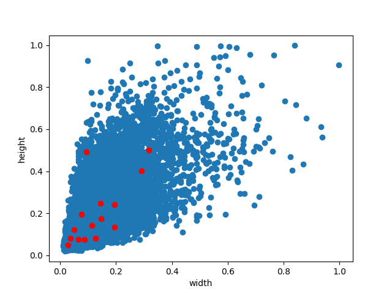

# kmeans-for-anchors
Generate anchors that match a custom dataset using the KMeans algorithm.

## Usage
Step 1: Run the command `python kmeans_plus_plus_for_anchors.py` to generate the specified number of anchors.  

Step 2: Run the command `python analysis_width_height.py` to visualize the distribution of the anchors on the dataset.  

Step 3: Based on the visualization results, you can fine-tune the anchor positions to reasonably cover more sample data.

Step 4: Replace the new positions of the fine-tuned anchors in the `anchor.txt` file, overwriting the original positions. Then, repeat Step 2 to review the results after fine-tuning.
